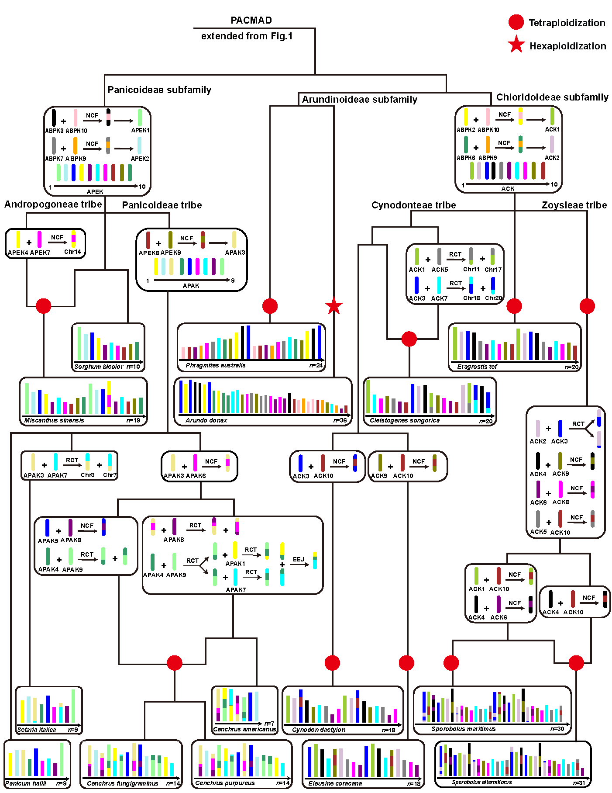

## Dynamic evolution of ancestral karyotypes in Poaceae

We applied the workflow at https://github.com/SunPengChuan/wgdi-example/blob/main/Karyotype_Evolution.md to identify ancestral karyotype of BOP and PACMAD clades  (**ABPK**，n=12) and further infer ancestral karyotypes for subfamilies and tribes with distinct chromosome structures based on sample genomes. These ancestral karyotypes are contained in the 'ancestral karyotype' folder.

Evolutionary trajectories from ancestral karyotypes to modern genomes are illustrated in the figure below.

 

**ABPK**:  Ancestral Karyotype of BOP and PACMAD clades  (12 protochromosomes)
**APHK**:  Ancestral Karyotype of Pharoideae subfamily  (12 protochromosomes)
**ABK**:  Ancestral Karyotype of Brachypodieae tribe  (10 protochromosomes)
**APTK**:  Ancestral Karyotype of Poeae and Triticeae tribes  (7 protochromosomes)
**ATK**:  Ancestral Karyotype of Triticeae tribe  (7 protochromosomes)
**APEK**:  Ancestral Karyotype of Panicoideae subfamily  (10 protochromosomes)
**APAK**:  Ancestral Karyotype of Panicoideae tribe  (9 protochromosomes)
**ACK**:  Ancestral Karyotype of Chloridoideae subfamily  (10 protochromosomes)

Within the **Poaceae** family, included two major clades: **BOP** (Bambusoideae, Oryzoideae, and Pooideae) and **PACMAD** (Panicoideae, Arundinoideae, Chloridoideae, Micrairoideae, Aristidoideae, and Danthonioideae), and three early-diverging subfamilies (Anomochlooideae, Pharoideae, and Puelioideae) 
we identify **ABPK** and further infer ancestral karyotypes for subfamilies and tribes with distinct chromosome structures based on sample genomes.

