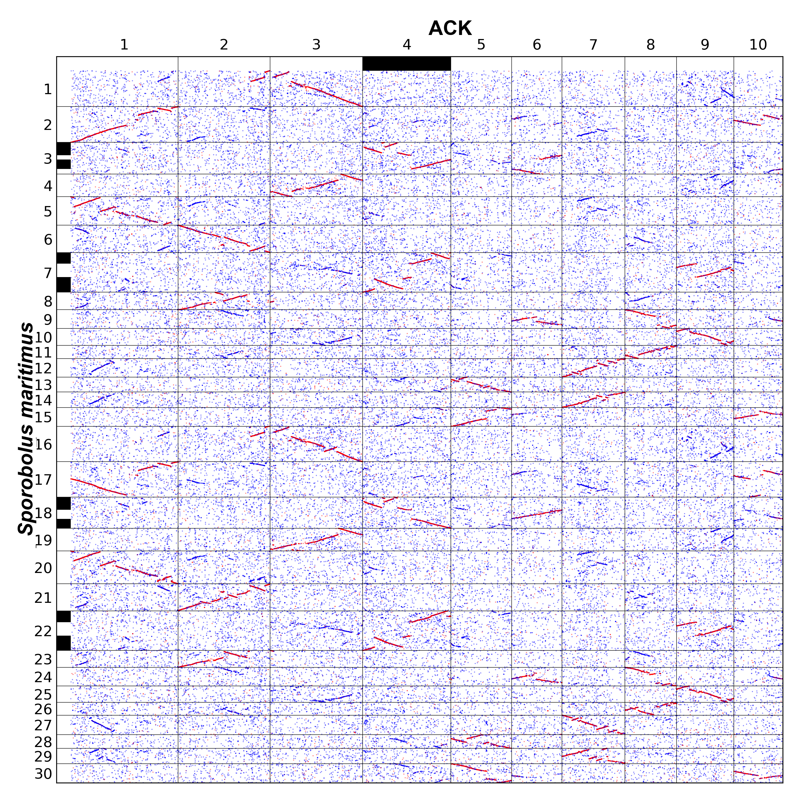
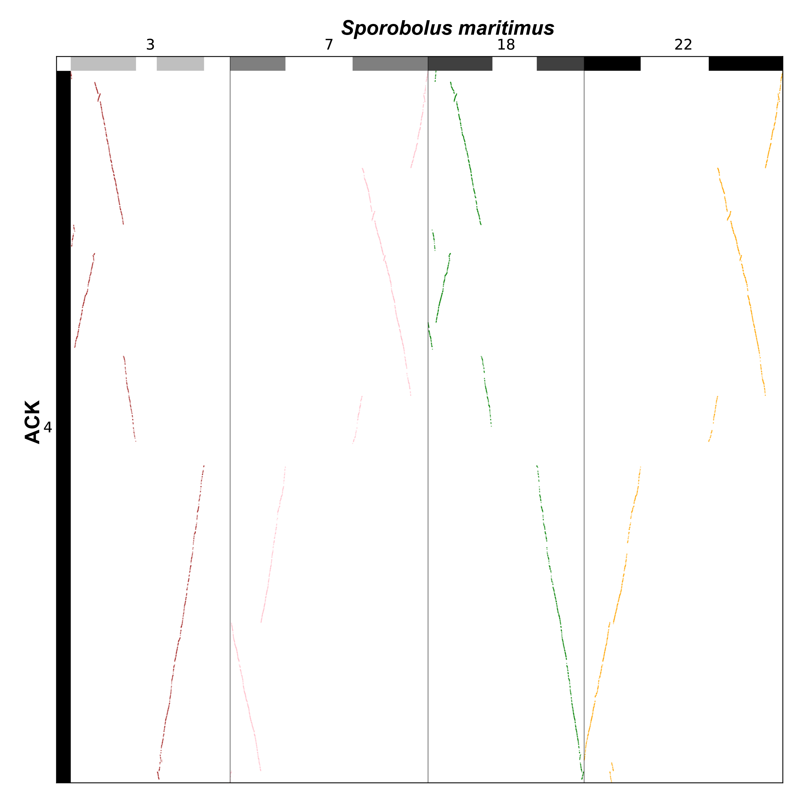
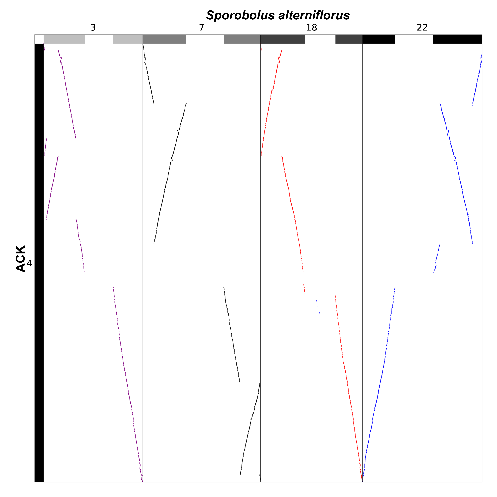
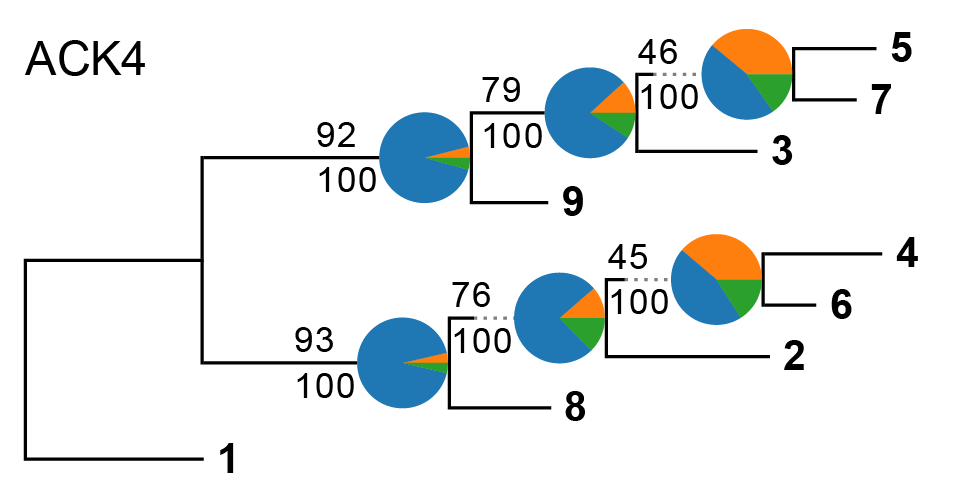
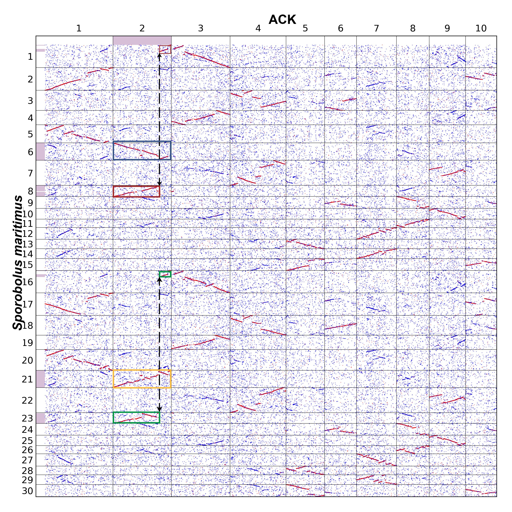
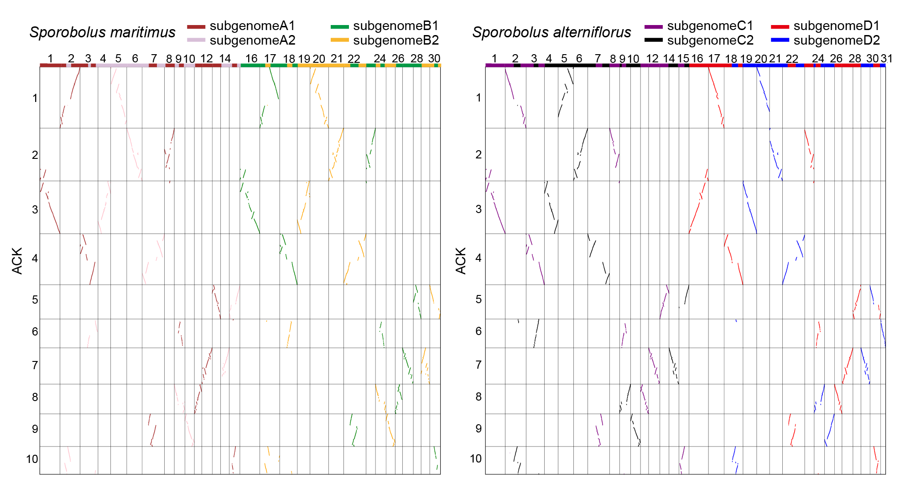
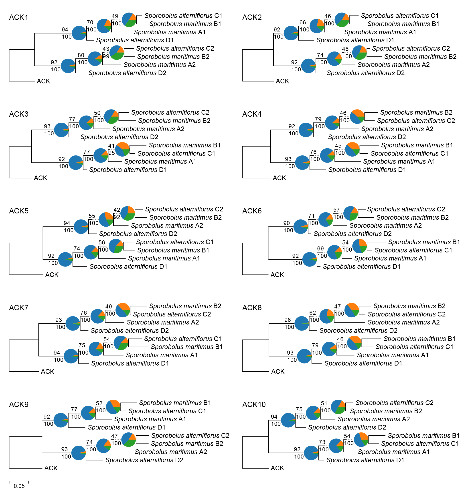

### Sub-subgenome phase analyses

Using Chr4 of the ancestral karyotype of subfamily Chloridoideae  (ACK) as a reference, we illustrated in detail how sub-subgenomes derived from *Sporobolus maritimus* and *S. alterniflorus* can be phased.

Sub-subgenome phasing in polyploid *S. maritimus*

We used WGDI ('-d') to generate a homologous gene dot plot between *S. maritimus* and ACK, with ‘ancestor_top = ACK_chr.ancestor.txt’. In the visualization, ACK Chr4 was distinctly colored, whereas the remaining chromosomes were shown in white. 

[ACK_chr.ancestor.txt](./Sporobolus_subgenome/ACK_chr.ancestor.txt)

| 1    | 1    | 5135 | white   | 1    |
| ---- | ---- | ---- | ------- | ---- |
| 2    | 1    | 4398 | white   | 1    |
| 3    | 1    | 4415 | white   | 1    |
| 4    | 1    | 4224 | #000000 | 1    |
| 5    | 1    | 2899 | white   | 1    |
| 6    | 1    | 2409 | white   | 1    |
| 7    | 1    | 3006 | white   | 1    |
| 8    | 1    | 2464 | white   | 1    |
| 9    | 1    | 2736 | white   | 1    |
| 10   | 1    | 2346 | white   | 1    |

Collinear regions were identified and integrated using WGDI with the '-icl' and '-bi' parameters. Stringent filtering was then performed using the correspondence module ('-c') to eliminate syntenic regions derived from earlier polyploidization events. Reference ACK chromosome color was then mapped onto *S. maritimus* chromosomes based on syntenic relationships using WGDI with the '-km' parameter, resulting in the ancestor_file of *S. maritimus*, namely Sporobolus_maritimus_chr.ancestor.txt. Finally, we generated a homologous gene dot plot between ACK and *S. maritimus* with WGDI ('-d'). The resulting dot plot is shown in the figure below.



Excluding the chromosomes marked  in white, the remaining chromosomes are shown below.

[Sporobolus_maritimus_chr.ancestor.txt](./Sporobolus_subgenome/Sporobolus_maritimus_chr.ancestor.txt)

| 3    | 1    | 1081 | #000000 | 1    |
| ---- | ---- | ---- | ------- | ---- |
| 3    | 1426 | 2208 | #000000 | 1    |
| 7    | 1    | 916  | #000000 | 1    |
| 7    | 2029 | 3278 | #000000 | 1    |
| 18   | 1    | 1067 | #000000 | 1    |
| 18   | 1802 | 2586 | #000000 | 1    |
| 22   | 1    | 936  | #000000 | 1    |
| 22   | 2064 | 3290 | #000000 | 1    |

We assigned all *S. maritimus* chromosome blocks to one of four sub-subgenomes based on chromosome complementarity. The last column of ancestor_file represents different sub-subgenomes.

[Sporobolus_maritimus_chr.ancestor.new.txt](./Sporobolus_subgenome/Sporobolus_maritimus_chr.ancestor.new.txt)

| 3    | 1    | 1081 | #000000 | 1    |
| ---- | ---- | ---- | ------- | ---- |
| 3    | 1426 | 2208 | #000000 | 1    |
| 7    | 1    | 916  | #000000 | 2    |
| 7    | 2029 | 3278 | #000000 | 2    |
| 18   | 1    | 1067 | #000000 | 3    |
| 18   | 1802 | 2586 | #000000 | 3    |
| 22   | 1    | 936  | #000000 | 4    |
| 22   | 2064 | 3290 | #000000 | 4    |

We defined sub-subgenome segments on the chromosomes and used WGDI with the parameters '-pc' and '-a'  to construct hierarchical gene lists for downstream analysis. The resulting dot plot is shown below.



The hierarchical gene lists : [Sporobolus_maritimus_chr_ACK_chr_4.alignment.csv](./Sporobolus_subgenome/Sporobolus_maritimus_chr_ACK_chr_4.alignment.csv)

| Et_4A_034743.mRNA1 | .                      | .                      | .                      | evm.model.Smar18g01604 |
| ------------------ | ---------------------- | ---------------------- | ---------------------- | ---------------------- |
| Et_4A_034744.mRNA1 | evm.model.Smar20g00516 | .                      | evm.model.Smar14g00334 | .                      |
| Et_4A_034745.mRNA1 | .                      | evm.model.Smar56g00735 | .                      | evm.model.Smar18g01602 |
| Et_4A_034741.mRNA1 | evm.model.Smar20g00518 | evm.model.Smar56g00734 | evm.model.Smar14g00336 | evm.model.Smar18g01601 |
| Et_4A_034742.mRNA1 | evm.model.Smar20g00519 | .                      | .                      | .                      |
| Et_4A_034746.mRNA1 | evm.model.Smar20g00520 | .                      | evm.model.Smar14g00337 | .                      |
| Et_4A_034829.mRNA1 | .                      | evm.model.Smar56g00733 | .                      | .                      |
| Et_4A_034830.mRNA1 | evm.model.Smar20g00525 | .                      | evm.model.Smar14g00345 | .                      |
| Et_4A_034831.mRNA1 | evm.model.Smar20g00527 | .                      | evm.model.Smar14g00347 | .                      |
| ...                | ...                    | ...                    | ...                    | ...                    |

Sub-subgenome phasing in polyploid  *S. alterniflorus*.


[Sporobolus_alterniflorus_chr.ancestor.new.txt](./Sporobolus_subgenome/Sporobolus_ alterniflorus_chr.ancestor.new.txt)

| 3    | 1    | 1081 | #000000 | 1    |
| ---- | ---- | ---- | ------- | ---- |
| 3    | 1426 | 2208 | #000000 | 1    |
| 7    | 1    | 916  | #000000 | 2    |
| 7    | 2029 | 3278 | #000000 | 2    |
| 18   | 1    | 1067 | #000000 | 3    |
| 18   | 1802 | 2586 | #000000 | 3    |
| 22   | 1    | 936  | #000000 | 4    |
| 22   | 2064 | 3290 | #000000 | 4    |



[Sporobolus_alterniflorus_chr_ACK_chr_4.alignment.csv](./Sporobolus_subgenome/Sporobolus_alterniflorus_chr_ACK_chr_4.alignment.csv)

| Et_4A_034743.mRNA1 | .              | Chr12G000530.1 | .              | Chr01G038870.1 |
| ------------------ | -------------- | -------------- | -------------- | -------------- |
| Et_4A_034744.mRNA1 | Chr07G005150.1 | .              | Chr04G006480.1 | Chr01G038850.1 |
| Et_4A_034745.mRNA1 | Chr07G005160.1 | Chr12G000540.1 | Chr04G006470.1 | Chr01G038840.1 |
| Et_4A_034741.mRNA1 | Chr07G005170.1 | Chr12G000550.1 | Chr04G006460.1 | Chr01G038830.1 |
| Et_4A_034742.mRNA1 | Chr07G005180.1 | .              | Chr04G006450.1 | .              |
| Et_4A_034746.mRNA1 | Chr07G005190.1 | .              | Chr04G006440.1 | .              |
| Et_4A_034829.mRNA1 | Chr07G005210.1 | Chr12G000560.1 | Chr04G006420.1 | Chr01G038820.1 |
| Et_4A_034830.mRNA1 | Chr07G005220.1 | .              | Chr04G006410.1 | .              |
| Et_4A_034831.mRNA1 | Chr07G005230.1 | .              | Chr04G006400.1 | .              |
| ...                | ...            | ...            | ...            | ...            |

##### Relationships among the sub-subgenomes

We extracted collinear genes from the corresponding sub-subgenomes and combined them into a file. Column 1 is from ACK Chr4, Columns 2 to 5 are from *S. maritimus*, Columns 6 to 9 are from *S. alterniflorus*.

[merged_chr_4.alignment.csv](./Sporobolus_subgenome/merged_chr_4.alignment.csv)

| Et_4A_034743.mRNA1 | .                      | .                      | .                      | evm.model.Smar18g01604 | .              | Chr12G000530.1 | .              | Chr01G038870.1 |
| ------------------ | ---------------------- | ---------------------- | ---------------------- | ---------------------- | -------------- | -------------- | -------------- | -------------- |
| Et_4A_034744.mRNA1 | evm.model.Smar20g00516 | .                      | evm.model.Smar14g00334 | .                      | Chr07G005150.1 | .              | Chr04G006480.1 | Chr01G038850.1 |
| Et_4A_034745.mRNA1 | .                      | evm.model.Smar56g00735 | .                      | evm.model.Smar18g01602 | Chr07G005160.1 | Chr12G000540.1 | Chr04G006470.1 | Chr01G038840.1 |
| Et_4A_034741.mRNA1 | evm.model.Smar20g00518 | evm.model.Smar56g00734 | evm.model.Smar14g00336 | evm.model.Smar18g01601 | Chr07G005170.1 | Chr12G000550.1 | Chr04G006460.1 | Chr01G038830.1 |
| Et_4A_034742.mRNA1 | evm.model.Smar20g00519 | .                      | .                      | .                      | Chr07G005180.1 | .              | Chr04G006450.1 | .              |
| Et_4A_034746.mRNA1 | evm.model.Smar20g00520 | .                      | evm.model.Smar14g00337 | .                      | Chr07G005190.1 | .              | Chr04G006440.1 | .              |
| Et_4A_034829.mRNA1 | .                      | evm.model.Smar56g00733 | .                      | .                      | Chr07G005210.1 | Chr12G000560.1 | Chr04G006420.1 | Chr01G038820.1 |
| Et_4A_034830.mRNA1 | evm.model.Smar20g00525 | .                      | evm.model.Smar14g00345 | .                      | Chr07G005220.1 | .              | Chr04G006410.1 | .              |
| Et_4A_034831.mRNA1 | evm.model.Smar20g00527 | .                      | evm.model.Smar14g00347 | .                      | Chr07G005230.1 | .              | Chr04G006400.1 | .              |
| ...                | ...                    | ...                    | ...                    | ...                    | ...            | ...            | ...            | ...            |

we constructed collinear gene sets, each containing at least six collinear genes. Gene trees were constructed for each gene set, rooted with the corresponding homologous gene from ACK Chr4, and summarized into a consensus tree (`wgdi -at`)

```shell
cat Sporobolus_maritimus_chr_longest.prot.fa Sporobolus_alterniflorus_chr_longest.prot.fa ACK_chr_longest.prot.fa > all.prot.fa
for chr in 4
do
awk -v chr=$chr '$1==chr' ACK_chr.len > ACK_chr.$chr.len
echo "
[alignmenttrees]
alignment = merged_chr_4.alignment.csv
gff = ACK_chr.gff
lens = ACK_chr.$chr.len
dir = ACK_chr.$chr.tree
sequence_file = all.prot.fa
trees_file =  ACK_chr.$chr.trees.nwk
align_software = mafft
tree_software = iqtree
model = MFP
trimming = trimal
minimum = 6
delete_detail = true" > ACK_chr.$chr.conf
wgdi -at ACK_chr.$chr.conf
astral-pro3 --root 1 -i ACK_chr.$chr.trees.nwk -u 3 -t 60 -o ACK_chr.$chr.trees.nwk.astral
phytop -pie -cp ACK_chr.$chr.trees.nwk.astral
done
```



**Sub-subgenome phylogeny from phased results of WGDI.** 1 = ACK, 2 = *Sporobolus alterniflorus* A1, 3 = *Sporobolus maritimus* A2, 4 = *Sporobolus maritimus* B1, 5 = *Sporobolus maritimus* B2, 6 = *Sporobolus alterniflorus* C1, 7 = *Sporobolus alterniflorus* C2, 8 = *Sporobolus alterniflorus* D1, 9 = *Sporobolus alterniflorus* D2


WGDI ('-d') was used to construct a homologous dot plot between *S. maritimus* and ACK. Synteny associated with ACK Chr2 was dispersed across multiple *S. maritimus* chromosomes. By integrating complementary syntenic blocks, we resolved sub-subgenome phasing. Two chromosomes (Chr6 and Chr21) exhibited one-to-one correspondence with ACK Chr2 and were assigned to distinct sub-subgenomes. Two additional chromosome pairs (Chr1–Chr8 and Chr16–Chr23) showed partial but complementary syntenic associations with ACK Chr2, supporting their assignment to another two sub-subgenomes. 



We constructed four sub-subgenomes in *S. alterniflorus* that correspond to ACK Chr2 using the same  strategy.


The sub-subgenomes of two *Sporobolus* species were phased using 10 ACK chromosomes as references.
Chromosome segment assignments in the final column were adjusted based on chromosomal evolutionary relationships, with identical labels representing the same sub-subgenome.

[raw_Sporobolus_maritimus_chr.ancestor.txt](./Sporobolus_subgenome/raw_Sporobolus_maritimus_chr.ancestor.txt)

[raw_Sporobolus_alterniflorus_chr.ancestor.txt](./raw_Sporobolus_subgenome/raw_Sporobolus_alterniflorus_chr.ancestor.txt)




10 chromosome-based consensus trees rooted with the corresponding ACK chromosomes are shown below.



